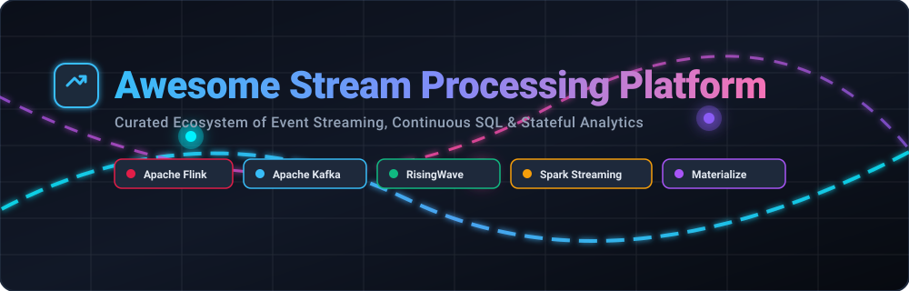

# 🌊 Awesome Stream Processing Platform: Real-Time Event Streams, Continuous SQL & Stateful Analytics

  

  
  
  
  
  

> 🚀 **Curated Directory of Managed SaaS Platforms & Open-Source Projects for Stream Processing, Event Streaming & Continuous Analytics**  
> *Focused on Real-Time Stream Processing, Streaming SQL, Event-Driven Architecture, CDC, Materialized Views & Sub-Second Latency Analytics*  
> **Last updated: September 2026**

---

## 📌 Table of Contents
- [📖 Overview](#-overview)
- [☁️ SaaS / Hosted Streaming Platforms](#%EF%B8%8F-saas--hosted-streaming-platforms)
- [⚡ Open-Source Stream Processing Projects](#-open-source-stream-processing-projects)
- [💡 Core Architecture Concepts](#-core-architecture-concepts)
- [🤝 How to Contribute](#-how-to-contribute)
- [📈 Star History](#-star-history)
- [⚖️ Disclaimer](#%EF%B8%8F-disclaimer)

---

## 📖 Overview

This repository provides a comprehensive, SEO-optimized, curated guide to **SaaS/hosted cloud platforms** and **open-source projects** in the **Stream Processing** ecosystem. These technologies enable organizations to ingest, process, transform, enrich, and serve streaming data continuously in real time—powering low-latency applications, automated alerting, streaming ETL, change data capture (CDC), and materialized views.

Whether you are evaluating managed cloud services (such as **Confluent Cloud**, **RisingWave Cloud**, or **Decodable**) or deploying enterprise open-source engines (**Apache Flink**, **Apache Kafka**, **Redpanda**, **Debezium**), this list serves as an authoritative guide for streaming data engineers and software architects.

---

## ☁️ SaaS / Hosted Streaming Platforms

> 📊 **Market Analysis & Fragmentation**:  
> The global Event Stream Processing (ESP) and Data Streaming Platform market is estimated at **~$3.5 Billion in 2026** and is projected to reach **$8.5+ Billion by 2030** (CAGR of ~18%). The sector is **moderately to highly fragmented**—featuring cloud hyperscalers (AWS, GCP, Azure), category leaders (Confluent, Ververica, Aiven), and innovative specialized startups (RisingWave, Materialize, Tinybird, Decodable) rather than a single "winner-take-all" monopoly.

The table below lists leading managed SaaS/Hosted stream processing platforms sorted by **Company Scale / Valuation (Descending)**:

| Platform | Overview | Company Scale (Valuation / Revenue) | Starting Pricing | Free Tier / Trial Limits |
|---|---|---|---|---|
| **[AWS Managed Service for Apache Flink](https://aws.amazon.com/managed-service-for-apache-flink/)** | Fully managed AWS cloud service running Apache Flink applications without cluster maintenance overhead. | **~$1.9 Trillion** Market Cap (Amazon / AWS, ~$575B Revenue) | Starts at **$0.11 / KPU-hour** (Kinesis Processing Unit: 1 vCPU + 4GB RAM) | **$200 in free credits for 30 days** via AWS Free Tier new accounts |
| **[Microsoft Azure Stream Analytics](https://azure.microsoft.com/services/stream-analytics/)** | Fully managed real-time analytics & complex event-processing (CEP) engine on Microsoft Azure. | **~$3.1 Trillion** Market Cap (Microsoft, ~$245B Revenue) | Starts at **$0.11 / Streaming Unit (SU)-hour** | **$200 in free credits for 30 days** for new Azure accounts |
| **[Google Cloud Dataflow](https://cloud.google.com/dataflow)** | Serverless, fully managed GCP service for unified stream and batch processing using Apache Beam. | **~$2.1 Trillion** Market Cap (Alphabet / Google, ~$305B Revenue) | Starts at **$0.056 / vCPU-hour** and $0.00355 / GB-hour | **$300 in free credits for 90 days** for new GCP accounts |
| **[Flink Cloud by Ververica](https://www.ververica.com/)** | Managed Apache Flink service from original Flink creators for production stream processing & stateful apps. | **~$200 Billion** Parent Market Cap (Alibaba Group / ~$90M+ acquisition) | Starts at **0.01 Compute Unit (centiCU) / hour** ($0.01/centiCU-hr on cloud marketplaces) | **$400 in free credits** for platform trial; Free-forever Community Edition (self-managed Helm) |
| **[Confluent Cloud](https://www.confluent.io/)** | Fully managed Apache Kafka & Flink platform with stream processing, connectors, and governance from Kafka creators. | **~$7.5 Billion** Market Cap (Public NASDAQ: CFLT, ~$1.0B ARR) | Starts at **$0.14 / eCKU-hour** (Basic cluster) + $0.05/GB data transfer | **30-day free trial** with **$400 in free credits** valid across all services |
| **[Aiven for Apache Flink](https://aiven.io/)** | Managed Flink & Kafka service delivering open-source streaming infrastructure with operational simplicity. | **~$3.0 Billion** Valuation (Series D unicorn status, $100M+ ARR) | Starts at **$0.57 / hour** (~$400/month for single-node deployment) | **30-day free trial** with **$300 in free credits** across Aiven services |
| **[Materialize Cloud](https://materialize.com/)** | Managed streaming database maintaining incrementally updated materialized views with strong PostgreSQL consistency. | **~$1.2 Billion** Valuation (Series C valuation, $100M+ funding) | Starts at **$0.375 / hour** ($1.50/Compute Credit per hour, min 0.25 credit / 25cc cluster) | **7-day free trial** (capped at 4 compute credits per hour across clusters) |
| **[Upsolver](https://www.upsolver.com/)** | Cloud data platform for streaming data ingestion, continuous SQL pipelines, and lakehouse transformations. | **~$1.0 Billion** Parent Valuation (Acquired by Qlik / Thoma Bravo, $42M funding) | Starts at **$99 / TB ingested** (or $0.09 / RSU-hour on AWS Marketplace) | **30-day free trial** on AWS Marketplace with unlimited test queries |
| **[Tinybird](https://www.tinybird.co/)** | Real-time analytics platform built on ClickHouse for streaming ingestion and low-latency SQL APIs. | **~$150 Million** Valuation ($37M+ total funding raised) | Starts at **$25 / month** (Developer Plan) | **Free-forever Build Plan** (10 GB storage, 300 vCPU hrs/mo, 1,000 requests/day, max 0.5 vCPU) |
| **[RisingWave Cloud](https://risingwave.com/)** | Managed service for RisingWave streaming database, featuring PostgreSQL-compatible streaming SQL & materialized views. | **~$120 Million** Valuation ($36M+ total funding raised) | Starts at **$0.227 / RWU-hour** (Basic tier; 1 RWU = 1 vCPU / 4GB RAM) | **7-day free trial** (up to 4 RWUs / 4 vCPUs and 16 GiB RAM limit) |
| **[Decodable](https://www.decodable.co/)** | Modern managed Flink platform emphasizing SQL-first development and pay-per-use stream pipelines. | **~$100 Million** Valuation ($20M+ Series A funding led by Bain Capital) | Starts at **$0.12 / task credit** (On-Demand pay-as-you-go; $0.10/credit on Enterprise) | **Free-forever plan** ($0/mo, up to 4 active tasks, capped streams & short retention) |
| **[Estuary](https://estuary.dev/)** | Real-time data integration platform focused on CDC, continuous pipelines, and streaming SQL. | **~$60 Million** Valuation ($17M+ Series A funding raised) | Starts at **$0.75 / GB** data moved (Cloud Plan pay-as-you-go, + $100/connector/month capped) | **Free-forever plan** (10 GB/mo data movement, 2 active connectors) & 30-day trial |
| **[DeltaStream](https://deltastream.io/)** | Serverless stream processing platform powered by Flink & Kafka for real-time streaming SQL & continuous analytics. | **~$40 Million** Valuation ($15M+ Seed/Series A funding raised) | Starts at **$300 / month** (AWS Marketplace starter tier) | **14-day free trial** (includes sample Kafka `trial_store` environment & web console) |

---

## ⚡ Open-Source Stream Processing Projects

Below is a curated list of top open-source event streaming & stream processing engines, sorted by **GitHub Star Count (Descending)**:

- **[Apache Spark](https://github.com/apache/spark)**   
  ⚡ *Unified engine for large-scale data processing.* Mature micro-batch and continuous processing engine (Structured Streaming) ideal when batch and streaming workloads share the same infrastructure.

- **[Apache Kafka](https://github.com/apache/kafka)**   
  🚀 *Foundational distributed event streaming platform.* Combined with Kafka Streams or ksqlDB, it enables high-throughput, real-time stream processing directly on Kafka topics.

- **[Apache Flink](https://github.com/apache/flink)**   
  🔥 *The dominant open-source stream processing engine.* Supports high-throughput, low-latency, stateful computations, complex event processing (CEP), and Flink SQL.

- **[Apache Pulsar](https://github.com/apache/pulsar)**   
  🌌 *Cloud-native distributed messaging & streaming platform.* Features native multi-tenancy, geo-replication, and lightweight stream processing via Pulsar Functions.

- **[Redpanda](https://github.com/redpanda-data/redpanda)**   
  🐼 *High-performance Kafka-compatible streaming engine.* Written in C++ without JVM overhead, offering low latency, simplified operations, and complete Kafka API compatibility.

- **[Debezium](https://github.com/debezium/debezium)**   
  🔄 *Distributed Change Data Capture (CDC) platform.* Captures row-level database changes in real time and streams them directly into Kafka, Flink, or custom event pipelines.

- **[RisingWave](https://github.com/risingwavelabs/risingwave)**   
  🌊 *Fully open-source (Apache 2.0) streaming database written in Rust.* PostgreSQL wire-compatible, designed for streaming SQL, real-time materialized views, and elastic scaling.

- **[Apache Beam](https://github.com/apache/beam)**   
  🌉 *Unified programming model for batch and streaming data processing.* Runs pipelines across multiple execution engines including Flink, Spark, and Google Cloud Dataflow.

- **[Materialize](https://github.com/MaterializeInc/materialize)**   
  🔮 *Source-available streaming database.* Focused on incrementally maintained materialized views with strong ANSI SQL consistency and PostgreSQL interface.

- **[Apache Storm](https://github.com/apache/storm)**   
  🌩️ *Pioneering distributed real-time computation system.* Enables reliable processing of unbounded streams of data with sub-millisecond latencies.

- **[ksqlDB](https://github.com/confluentinc/ksql)**   
  💬 *Event streaming database for Apache Kafka.* Allows developers to build real-time streaming applications and continuous SQL queries over Kafka topics.

- **[Arroyo](https://github.com/arroyosystems/arroyo)**   
  🏞️ *Distributed stream processing engine written in Rust.* Built for high-throughput, stateful SQL queries with sub-second state checkpointing and autoscaling.

- **[Bytewax](https://github.com/bytewax/bytewax)**   
  🐝 *Python-native stream processing framework.* Powered by Timely Dataflow in Rust under the hood, bringing stateful stream processing to the Python data ecosystem.

- **[HStreamDB](https://github.com/hstreamdb/hstream)**   
  💧 *Cloud-native streaming database.* Combines event storage with continuous stream processing and SQL query interfaces for real-time analytics.

- **[Apache Samza](https://github.com/apache/samza)**   
  🎯 *Distributed stream processing framework.* Built by LinkedIn for stateful stream processing on top of Apache Kafka and Apache YARN.

---

## 💡 Core Architecture Concepts

- **Change Data Capture (CDC)**: Ingesting row-level changes from OLTP databases (PostgreSQL, MySQL, Oracle) continuously into streaming platforms (via Debezium, Estuary).
- **Streaming SQL & Materialized Views**: Executing continuous queries over unbounded data streams and maintaining updated state incrementally with low latency.
- **Stateful Stream Processing**: Managing job state in RocksDB or distributed memory with fault tolerance and exactly-once semantics.
- **Event-Driven Architecture (EDA)**: Decoupling services using asynchronous message brokers (Kafka, Pulsar, Redpanda).

---

## 🤝 How to Contribute

1. Fork this repository.
2. Add or update entries in `README.md` (follow the tabular format for SaaS platforms and star-badge format for open-source projects).
3. Ensure descriptions are objective, factual, and include official links.
4. Submit a Pull Request (PR) with a brief summary of additions.

---

## 📈 Star History

---

## ⚖️ Disclaimer

- This is a community-curated directory intended for educational and architectural evaluation purposes.
- Trademarks belong to their respective owners.
